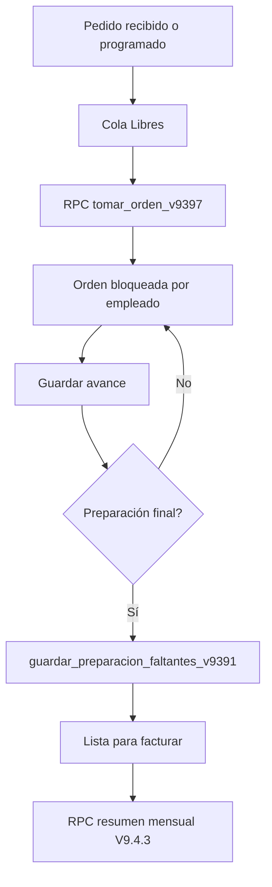

# Mapeo técnico de Carnicería — V9.4.3 R2

## Objetivo

Dar a cada despachador un resumen mensual exacto de clientes atendidos y trabajo terminado sin depender de la cantidad limitada de órdenes cargadas en el navegador. La implementación se validó exclusivamente en el proyecto staging `odlwbuagtrgmfpdohors`.

## Flujo del módulo

## Componentes y responsabilidades

| Capa | Componente | Responsabilidad |
|---|---|---|
| Interfaz | `renderCarniceria` | Pestañas, búsqueda, cola, tarjetas y progreso mensual. |
| Identidad | `tomado_por_empleado_id` | Vínculo canónico del trabajo con el empleado. |
| Concurrencia | `tomar_orden_v9397` | Bloqueo exclusivo y máximo de tres pedidos activos. |
| Preparación | `guardar_preparacion_v9381` | Guarda avances sin finalizar. |
| Finalización | `guardar_preparacion_faltantes_v9391` | Cierra preparación, registra peso y gestiona faltantes. |
| Liberación | `liberar_orden_v9382` | Exige motivo, libera el pedido y limpia avances no finalizados. |
| Métrica | `resumen_carniceria_mensual_v943` | Calcula el mes completo en PostgreSQL con RLS y permisos mínimos. |
| Datos | `ordenes.preparado_en` | Fecha real del trabajo terminado y fuente del período mensual. |

## Definición de indicadores

| Indicador | Regla |
|---|---|
| Clientes despachados | Clientes registrados por `cliente_id`; ocasionales por teléfono normalizado. Varias órdenes del mismo cliente cuentan una vez. |
| Pedidos preparados | Órdenes con `preparado_en` dentro del mes y estado distinto de `Anulado`. |
| Libras preparadas | Suma de `peso_preparado` de las órdenes válidas. |
| Tiempo promedio | Promedio entre `tomado_en` y `preparado_en`; solo usa muestras entre 0 y 480 minutos. |
| Duraciones atípicas | Cuenta tiempos negativos o mayores a 480 minutos. El pedido conserva su cliente, preparación y libras, pero no altera el promedio. |
| Preparados hoy | Finalizaciones del día en `America/Santo_Domingo`. |

No se muestra un porcentaje contra meta porque todavía no existe una meta mensual configurada. La barra actual representa únicamente el avance del calendario y evita presentar una productividad ficticia.

## Permisos

- Cuenta personal de Carnicería: solo consulta su empleado vinculado.
- Cuenta de estación: debe seleccionar un empleado activo de Carnicería.
- Gerente, Administrador o Supervisor: puede consultar al equipo o a un empleado.
- `anon` y `public`: no pueden ejecutar la RPC.
- La función es `SECURITY INVOKER`, por lo que conserva RLS y permisos del usuario.

## Escenarios simulados en staging

La simulación se ejecutó dentro de una transacción y terminó con `ROLLBACK`; no dejó clientes, empleados ni órdenes sintéticas persistentes.

| Escenario | Resultado esperado | Resultado |
|---|---|---|
| Cliente registrado con dos pedidos | Un cliente, dos pedidos | Aprobado |
| Dos clientes registrados | Dos identidades distintas | Aprobado |
| Ocasional con teléfono en dos formatos | Un solo cliente | Aprobado |
| Ocasionales con teléfonos distintos | Clientes distintos | Aprobado |
| Registro heredado sin `tomado_por_empleado_id` | Atribución por nombre conservada | Aprobado |
| Tiempo final anterior a la toma | Pedido contado; duración atípica informada y omitida del promedio | Aprobado |
| Pedido abierto durante más de ocho horas | Pedido contado; duración atípica informada y omitida del promedio | Aprobado |
| Orden anulada | Excluida | Aprobado |
| Preparación no finalizada | Excluida | Aprobado |
| Orden del mes anterior | Excluida | Aprobado |
| Orden del mes siguiente | Excluida | Aprobado |
| Usuario consulta otro empleado | Rechazo `42501` | Aprobado |
| Cuenta de estación selecciona empleado | Permitido | Aprobado |
| Gerencia consulta el equipo | Permitido | Aprobado |

Resultado cuantitativo del conjunto controlado R1: 6 clientes únicos, 8 pedidos, 80 lb, 28.6 minutos promedio y 8 preparados en el día. En el fixture persistente de staging, R2 conserva 2 clientes, 2 pedidos y 40 lb, corrige el promedio de 1,076.9 a 2.1 minutos y expone 1 duración atípica excluida.

## Hallazgos

### Críticos

1. El módulo Productividad suma `clientes: 1` por cada orden del despachador. Ese valor representa pedidos, no clientes únicos.
2. Productividad calcula sobre `state.ordenes`, pero V9.4.2 carga un subconjunto incremental. Un total mensual calculado allí puede quedar incompleto.
3. Staging conserva la política `empleados_operativos_all` con condición `true` y privilegios amplios para `authenticated`. Es deuda de seguridad independiente de esta mejora y debe corregirse en una migración dedicada después de verificar las pantallas administrativas.

### Altos

1. La cola visible de una cuenta de estación se atribuía a la cuenta compartida por `tomado_por_user`, mezclando pedidos de empleados distintos. V9.4.3 la corrige usando `tomado_por_empleado_id` y el empleado seleccionado.
2. Un escenario staging existente produjo 1,076.9 minutos promedio por una toma abierta durante casi 36 horas. V9.4.3 R2 conserva el pedido en los demás indicadores, excluye esa muestra del promedio y la informa como duración atípica.

### Medios

1. Los campos de texto `tomado_por` y `preparado_por` pueden quedar desactualizados si se renombra al empleado. Se mantienen solo como compatibilidad; las operaciones nuevas deben usar el ID.
2. La pantalla no tiene una meta mensual configurable. Añadirla sin reglas de negocio produciría un porcentaje engañoso.
3. El buscador de Carnicería solo anuncia cliente en el placeholder aunque `matchOrder` también encuentra otros campos; conviene explicitar “cliente, orden o producto”.

## Recomendaciones siguientes

1. Migrar Productividad a una RPC mensual completa y reutilizar exactamente la misma identidad única de clientes.
2. Crear una auditoría de seguridad separada para consolidar políticas RLS antiguas y retirar privilegios de escritura generales en `empleados_operativos`.
3. Añadir alerta de pedido tomado por más de 45 minutos y escalamiento configurable, sin liberación automática.
4. Incorporar metas por empleado solo después de definir quién las administra, vigencia, historial y tratamiento de ausencias.
5. Añadir pruebas de navegador para dos sesiones concurrentes tomando la misma orden; el servidor ya lo protege, pero falta una prueba end-to-end repetible.

## Despliegue

Las migraciones V9.4.3 R1 y R2 están aplicadas en staging. Producción no fue modificada. Antes de publicar se requiere autorización explícita, aplicar ambas migraciones en producción, ejecutar `npm test`, construir con las variables públicas correctas de Supabase y desplegar mediante Wrangler.
